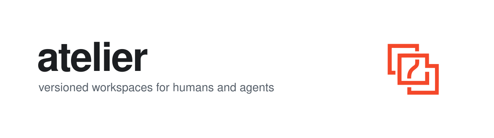

<p align="center">
  <picture>
    <source media="(prefers-color-scheme: dark)" srcset="assets/cover-dark.svg">
    
  </picture>
</p>

[](https://crates.io/crates/atelier-sdk)
[](https://docs.rs/atelier-sdk)

Versioned workspaces for humans and AI agents.

atelier answers "what is a workspace in the age of agents": a named, versioned body of work content — code, spreadsheets, contracts, docs — with its own history, journal, profile, and policy, served to humans and agents through the same contracts.

- **Everything is versioned.** No unversioned state; every edit becomes a snapshot. Jujutsu's model is the engine, git is the boundary — every workspace is a real git repo you can clone, pull, and push.
- **Documents diff like code.** One diff library, a fidelity ladder (binary → projected text → rich), and format support shipped as packages. First package: docx → markdown.
- **Actions are recorded.** History records content states; the journal records acts and intent — who, in which session, on whose instruction, with what approval.
- **Agents are first-class.** Sessions, working copies, leases, landing, and a manifest, exposed over MCP and the `atelier` CLI.

Status: pre-alpha, under active design.

## Install

```bash
curl -fsSL https://atelier-ws.dev/install.sh | sh   # prebuilt binary (mac/linux)
```

The script installs to `~/.cargo/bin` and puts it on PATH for sh, bash, zsh,
and fish (`~/.profile`, `~/.zshrc`, fish's `conf.d`); open a new shell after
the first install. Any other shell: add `~/.cargo/bin` to PATH.

Or with a Rust toolchain: `cargo install atelier-ws` (from crates.io) or
`cargo install --git https://github.com/bipa-app/atelier atelier-ws` (from main).
Each installs the `atelier` binary.

Update a script install any time with `atelier update` (it runs the bundled
updater the installer places beside the binary); re-running the install
script does the same. Cargo installs update with `cargo install atelier-ws`.

## Quickstart

Build the `atelier` binary (the toolchain is pinned in `rust-toolchain.toml`):

```sh
git clone https://github.com/bipa-app/atelier
cargo install --path atelier/crates/cli
```

Tell atelier who you are, then work in a fresh directory. Every `atelier` command snapshots outstanding edits first — there is no save step:

```sh
mkdir -p ~/.config/atelier
cat > ~/.config/atelier/config.toml <<'EOF'
[actor]
name = "you"
kind = "human"
EOF

mkdir demo && cd demo
atelier init
echo "atelier keeps every edit" > notes.txt
atelier journal
echo "no save button, no lost work" >> notes.txt
atelier diff
```

The journal names who did what and when; the diff reads at the highest fidelity the format allows — a changed .docx prints a markdown line diff, never "binary files differ".

To publish verified commits, add your git identity and signing key — you stay the committer and signer of everything atelier writes, while agents keep authoring as themselves:

```toml
[git]
name = "Your Name"
email = "you@example.com"      # the email your git host verifies

[git.signing]
backend = "ssh"                # or "gpg" with a key id
key = "~/.ssh/id_ed25519"
```

From there:

- `atelier watch` — external edits (Finder, any editor) become attributed snapshots within seconds.
- `atelier attach <folder>` — bind an existing folder as the workspace's source.
- `atelier session open --summary "…"` — print a long-lived session id and working-copy path; edit there with normal tools, inspect with `atelier session diff <id>`, then `atelier land <id>` or `atelier session abandon <id>`.
- `atelier serve --mcp-stdio` — serve the workspace to agents over MCP: sessions, diffs, gated landing, journal.
- `atelier sessions` / `atelier requests` / `atelier approve <id>` — review and land an agent's change.

## The SDK

Everything the CLI does, the `atelier-sdk` crate does directly:

```toml
[dependencies]
atelier-sdk = "0.4"
```

With the actor configured as above, a workspace, a session, one write, and
a landing through the gate:

```rust
use atelier_sdk::{GateOutcome, Instruction, Workspace};

fn main() -> Result<(), Box<dyn std::error::Error>> {
    let mut workspace = Workspace::init("demo")?;
    let actor = workspace.actor().clone();
    let session = workspace.open_session(
        &actor,
        &Instruction {
            summary: "draft the notes".to_owned(),
            run_ref: None,
            verbatim: None,
        },
    )?;
    workspace.session_write(session.id, "notes.md", "The first note.\n")?;
    let outcome = workspace.land(session.id)?;
    assert!(matches!(outcome, GateOutcome::Landed { .. }));
    Ok(())
}
```

Under `atelier-sdk` sit three crates you can use alone:
`atelier-sdk-diff` (the diff model and fidelity ladder),
`atelier-sdk-docx` (Word documents projected to markdown and diffed),
and `atelier-sdk-remote` (bucket-backed sources over `object_store`).

## Contributing

CI runs the same gates you run locally: `cargo fmt --check`, `cargo clippy --workspace --all-targets -- -D warnings`, `cargo test --workspace`. Start with [CONTRIBUTING.md](CONTRIBUTING.md) — including how to ship support for a new document format as its own package.

Read next: [`CONTEXT.md`](CONTEXT.md) (the domain glossary), [`docs/adr/`](docs/adr/) (decisions), and [`plans/`](plans/) (PRD and current plan).

License: Apache-2.0
